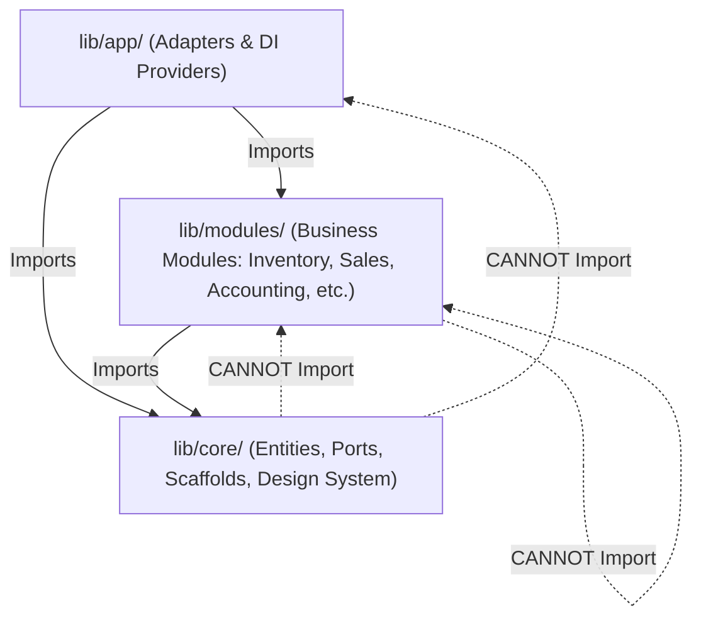
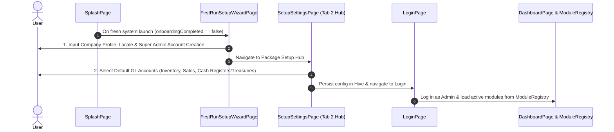

# NexaBiz ERP Architecture & Module Decoupling Methodology Guide

---

## 📌 1. Architectural Philosophy (Zero Cross-Module Business Coupling)

The **NexaBiz ERP** system is built on **Clean Architecture + Multi-Tenant Domain-Driven Design (DDD)**, enforcing a strict **Zero Cross-Module Business Coupling** principle.

### 💡 Core Principles & Objectives:
1. **Module Independence**: Every business package located in `lib/modules/<module_name>/` is an isolated, autonomous feature module that can be enabled or disabled without breaking the application runtime.
2. **No Direct Inter-Module Imports**: Direct imports of internal domain, data, or presentation files between distinct operational modules (e.g., `lib/modules/sales` importing `lib/modules/inventory`) are strictly prohibited.
3. **Core-Centric Ports (Dependency Inversion)**: Communication across business domains occurs exclusively via **Ports (Interfaces)** defined within the core layer (`lib/core/domain/ports/`).

---

## 🏗️ 2. Layering & Dependency Rules



### 1️⃣ Core Layer (`lib/core/`)
- **Contents**:
  - `domain/entities/`: Universal domain models (e.g., `AccountRole`, `TenantContext`).
  - `domain/ports/`: System-wide contracts and ports (e.g., `SetupAccountLookupPort`, `PostingPort`, `InventoryVoucherBookPort`).
  - `presentation/scaffolds/`: Shared UI scaffolds (`ModuleListScaffold`, `ModuleFormScaffold`).
  - `widgets/`, `theme/`, `utils/`: Core design system components.
- **Dependency Rule**:
  - ✅ Can import external Flutter/Dart packages and core utilities.
  - ❌ **STRICTLY FORBIDDEN** from importing any file from `lib/modules/` or `lib/app/`.

### 2️⃣ Business Modules Layer (`lib/modules/<module_name>/`)
- **Contents**:
  - `domain/`: Module-level entities, use cases, and repository interfaces.
  - `data/`: Local storage schemas, data sources, and repository implementations.
  - `presentation/`: UI screens, widgets, controllers, and feature providers.
  - `<module_name>.dart`: Consolidated Barrel Export file.
- **Dependency Rule**:
  - ✅ Allowed to import `lib/core/`.
  - ❌ **STRICTLY FORBIDDEN** from importing other business modules (e.g., `lib/modules/inventory` importing `lib/modules/sales`).

### 3️⃣ Application & Integration Layer (`lib/app/<module_name>/`)
- **Contents**:
  - Adapters and composition providers (e.g., `inventory_app_providers.dart`, `sales_app_providers.dart`).
- **Dependency Rule**:
  - ✅ Responsible for wiring `Core Ports` with concrete repository implementations from other modules via Riverpod dependency injection.

---

## 🔌 3. Ports & Adapters Pattern

When a business module (e.g., **Sales**) needs to perform an accounting ledger posting in another module (e.g., **Accounting**):

### Step 1: Define the Port Interface in `lib/core/domain/ports/`
```dart
// lib/core/domain/ports/sale_posting_port.dart
abstract class SalePostingPort {
  Future<void> postSaleInvoice(SaleInvoicePostingData data);
}
```

### Step 2: Consume the Port inside the Module via Riverpod
```dart
// lib/modules/sales/presentation/providers/sale_providers.dart
final salePostingPortProvider = Provider<SalePostingPort>((ref) {
  throw UnimplementedError('Must be overridden in App Adapters');
});
```

### Step 3: Implement the Adapter in `lib/app/sales/`
```dart
// lib/app/sales/sales_app_providers.dart
class SalesAccountingPostingAdapter implements SalePostingPort {
  SalesAccountingPostingAdapter(this._documentPostingOrchestrator);
  final DocumentPostingOrchestrator _documentPostingOrchestrator;

  @override
  Future<void> postSaleInvoice(SaleInvoicePostingData data) async {
    // Translate data and trigger accounting entries
  }
}

// Provide implementation via Riverpod
final salesAppPostingPortProvider = Provider<SalePostingPort>((ref) {
  return SalesAccountingPostingAdapter(ref.watch(documentPostingOrchestratorProvider));
});
```

---

## 📦 4. Barrel Exports Standard

Every module must expose a single barrel file located at its root: `lib/modules/<module_name>/<module_name>.dart`.

```dart
// lib/modules/inventory/inventory.dart
export 'domain/entities/product.dart';
export 'domain/repositories/inventory_repository.dart';
export 'presentation/pages/inventory_home_page.dart';
export 'inventory_module.dart';
```

---

## 🔄 5. App Launch & Initialization Lifecycle

To ensure a seamless, non-looping initialization sequence:



---

## 🛠️ 6. Developer Compliance Checklist

Before committing or submitting pull requests:

- [ ] Does any UI page or provider in `lib/modules/x` contain direct imports from `lib/modules/y`?
  - **If YES**: Move the contract to `lib/core/domain/ports/` and create an adapter in `lib/app/x/`.
- [ ] Does `flutter analyze lib/` return zero error issues?
- [ ] Are default account selections persisted in `CompanyAccountingConfig` and `CompanyInventoryConfig` with multi-tenant `companyId` scoping?
- [ ] Is the module dynamically registered and read from `ModuleRegistry`?
