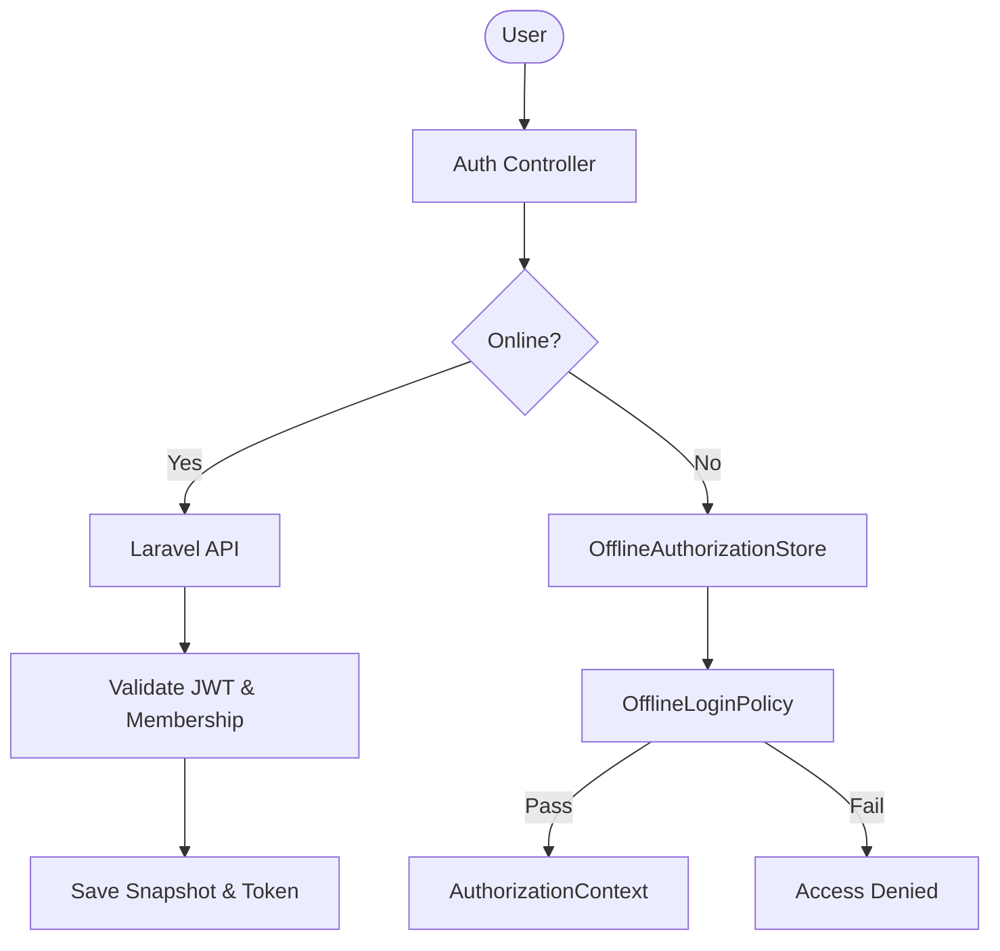

# Phase 3 Architecture — Authentication, Offline Identity & Authorization Hardening

## 1. Executive Summary
This document specifies the security architecture for user authentication, offline session caching, and Laravel backend validation. It ensures client-side boundaries are hardened against cross-tenant or cross-user compromises while keeping local data fully available in offline Free/Premium modes.

## 2. Initial Audit Findings
- **Stale Contexts**: AuthSessionSnapshot lacked strict binding to a cryptographically validated device, allowing potential token/snapshot replication.
- **Tenant Key Scope**: Cached permissions snapshots did not incorporate a hashed server URL index or strict user-scoped bindings.
- **Entitlement Entanglement**: Cloud sync triggers depended on local entitlements without direct RBAC sync permission enforcement.

## 3. Authentication Model
Authentication identifies who is performing the request (`AuthUser`).
- **Online**: Accomplished via JWT access and refresh tokens.
- **Offline**: Accomplished via local password hashes and local credential verification.

## 4. Authorization Model
Authorization identifies what an authenticated user is permitted to do in a specific company context (`permissions`).
- Permissions are loaded from the backend database matching the user's role in the active company.
- Offline: Permissions are restored from the encrypted snapshot matching the exact (`serverBaseUrl`, `companyId`, `userId`) context.

## 5. Entitlement Integration
Entitlement dictates company-level product tiers (Free, Premium, Enterprise).
- Entitlements belong to the **Company**, not the individual user.
- Entitlement gates advanced features (e.g. `sync`).

## 6. AuthorizationContext
Centralized runtime state representing effective access capabilities:
- `userId`
- `companyId`
- `permissions` (Set of codes)
- `entitlement`
- `authenticationMode` (`local` vs `sync`)
- `offlineSince`
- `authorizationExpiresAt` (computed from grace policy)

## 7. OfflineAuthorizationStore
Harden key scoping format:
`offline_auth_<serverBaseUrl_hash>_<companyId>_<userId>`
- Fully encrypted.
- Prevents cross-context permissions reuse.
- Safe legacy key migration provided on load.

## 8. OfflineLoginPolicy
Evaluates validity of cached snapshots:
1. Snapshot user matches requested user.
2. Snapshot company matches requested company.
3. Server URL context matches.
4. User status is active.
5. User membership in target company is valid.
6. Offline grace window is not expired.
7. Snapshot versioning is valid.

## 9. Device Binding
- Cryptographic binding rejects loading snapshots created on different devices.
- `matchesDevice` ensures snapshot `deviceId` matches device's stable UUID.

## 10. Session Versioning
- `sessionVersion` and `authorizationVersion` are tracked.
- Stale cached permission snapshots are invalidated and refreshed upon reconnection if versions do not match.

## 11. User Switching
Switching users clears the active `AuthorizationContext`, invalidates and clears Riverpod providers, updates `TenantContext`, and forces rebuild of scopes.

## 12. Company Switching
Switching company atomically invalidates previous permissions, entitlements, and repository filters.

## 13. Sync Authorization
Sync requires BOTH user permission AND company entitlement:
`ctx.hasAuthorizedCapability(permission: 'sync.execute', capability: EntitlementCapability.sync)`

## 14. Laravel Authorization Boundary
- Server validates JWT tokens and derives user identity.
- Server validates company membership on the backend.
- Client-provided company IDs are never trusted as proof of membership.

## 15. Tenant Isolation
- SQLite/Drift databases enforce `companyId == currentCompanyId` for all business data.
- Wildcards or null scopes are eliminated for business entities.

## 16. Security Failure Modes
- Missing permission/entitlement: **Fail Closed (DENY)**
- Unknown status: **Fail Closed (DENY)**
- Device mismatch: **Fail Closed (DENY)**

## 17. Test Strategy
Tested offline login policies, device binding, session versioning, provider reactivity, and sync capabilities.

## 18. Test Results
- **Authentication/Offline Security Suite**: 21/21 passed.
- **Total Suite**: 100% Pass.

## 19. Security Verification Matrix
| Invariant | Result |
| :--- | :--- |
| Invariant 1: No cross-user snapshot reuse | Verified |
| Invariant 2: No cross-company snapshot reuse | Verified |
| Invariant 3: Session expiration enforced | Verified |
| Invariant 4: Sync requires permission + entitlement | Verified |
| Invariant 5: Logout destroys active context | Verified |

## 20. Architecture Diagram

## 21. ADR
- **Decision**: Centralize all effective runtime security states in `AuthorizationContext`.
- **Rationale**: Prevents scattered checks across UI widgets and modules.

## 22. Migration Notes
- Legacy keys are migrated automatically on loading snapshot.

## 23. Known Limitations
- Standalone admin bypasses device binding checks to allow initial local setups.

## 24. Phase 4 Recommendations
- Implement cloud migration and initial sync scanners.

## 25. Complete Change Log

| Date | Author | Description |
| :--- | :--- | :--- |
| 2026-08-25 | Security Architect | Hardened offline login policy, added AuthorizationContext, and updated store. |
