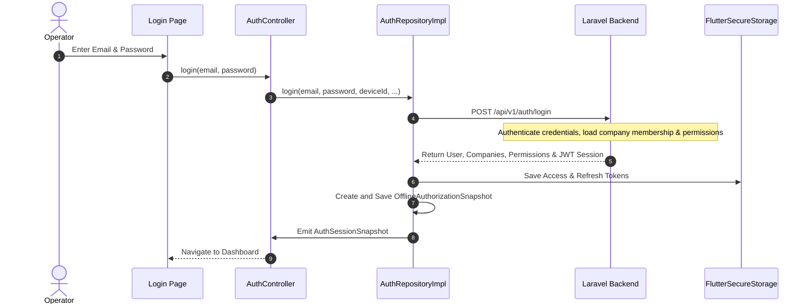
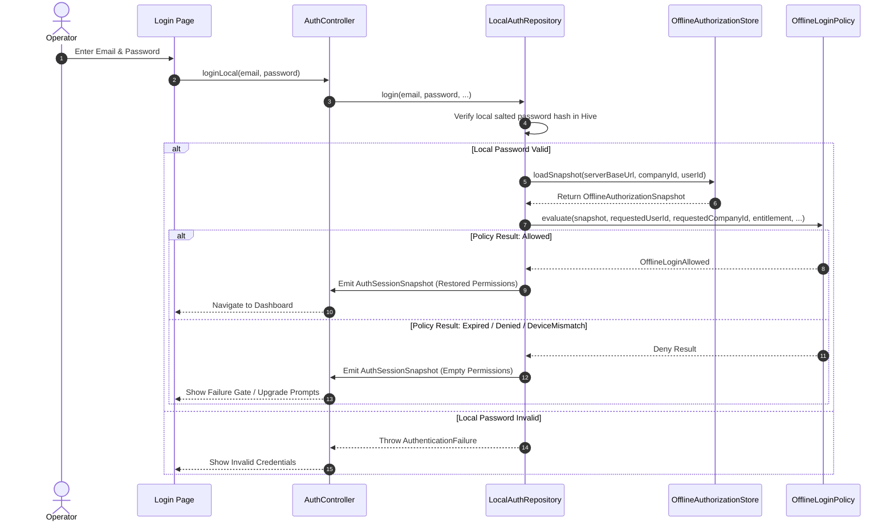
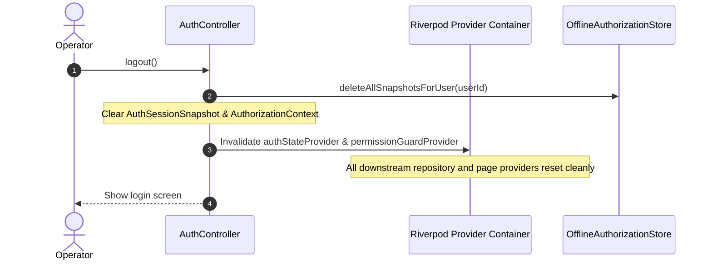
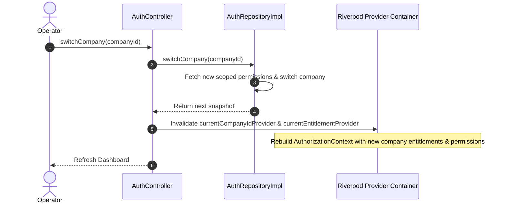
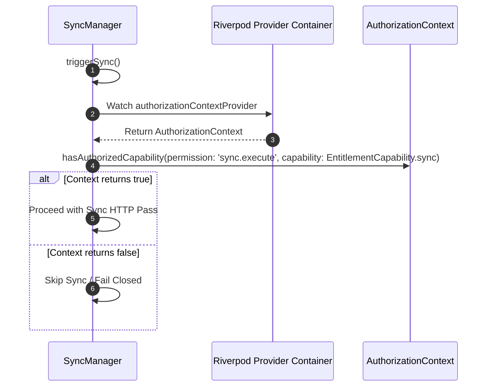
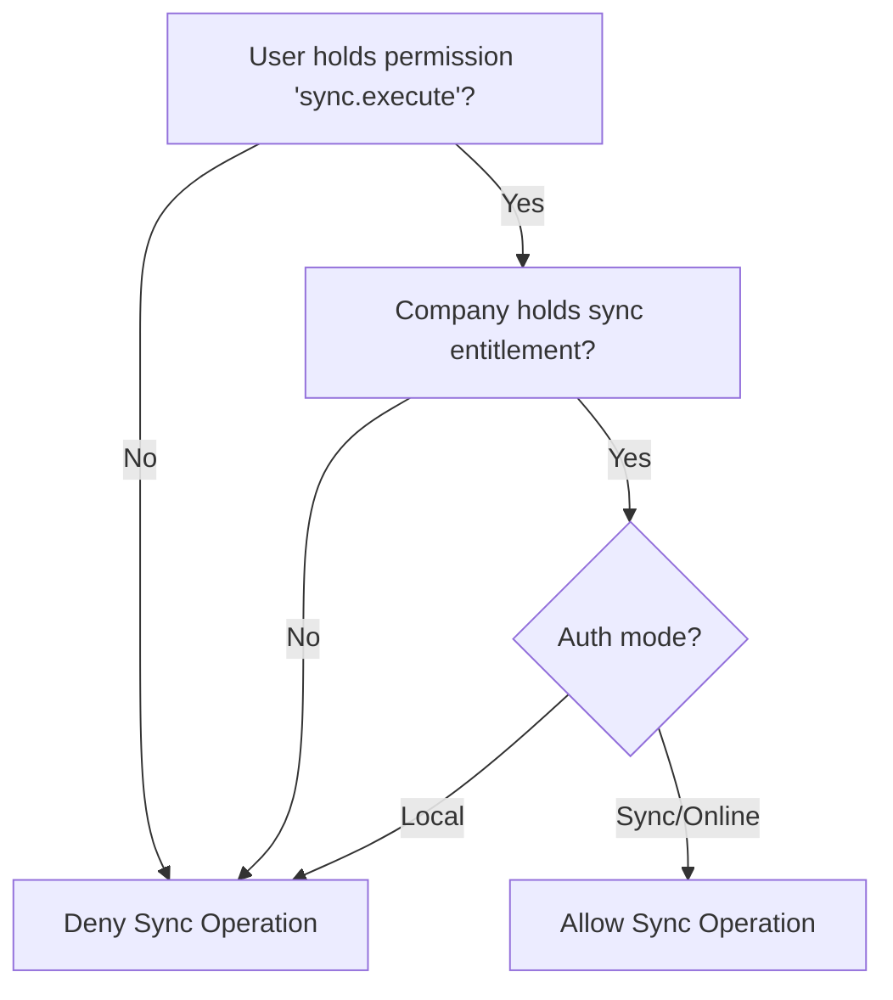

# Phase 3 Security Flow Diagrams

This document contains visual representations of security processes and transitions in the NexaBiz Business Platform.

---

## 1. Online Login Flow

---

## 2. Offline Login Flow

---

## 3. User Switching Flow

---

## 4. Company Switching Flow

---

## 5. Sync Authorization Flow

---

## 6. Entitlement + Permission Evaluation

