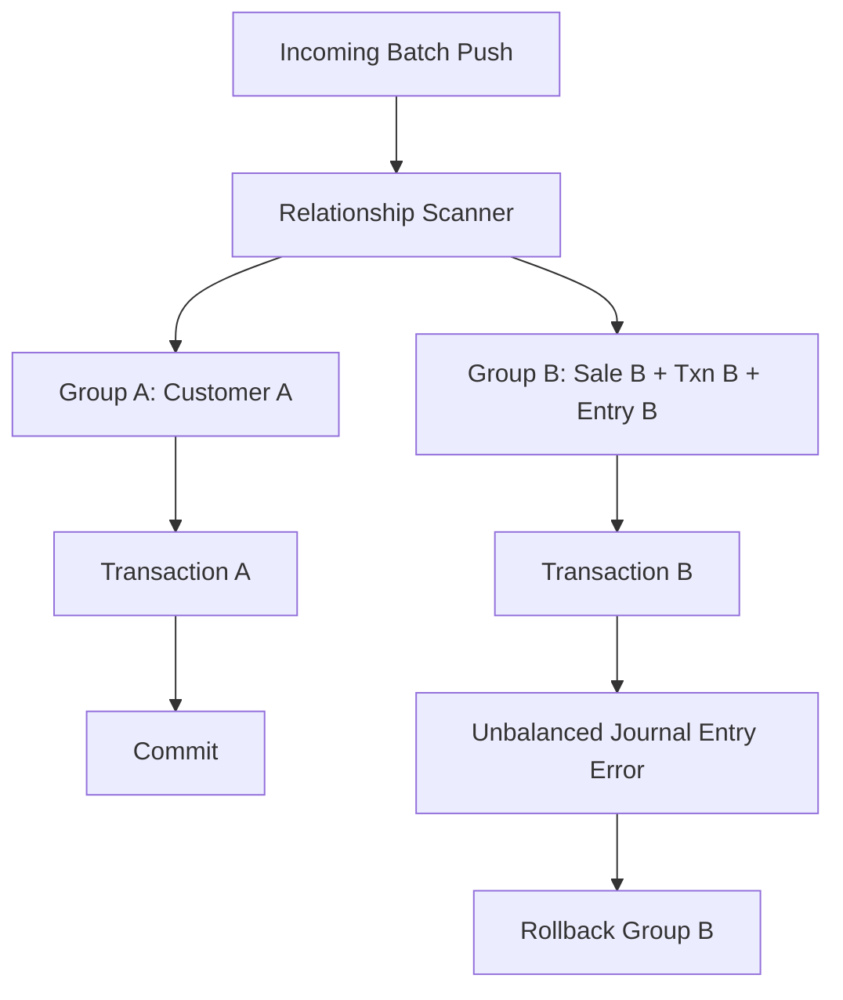
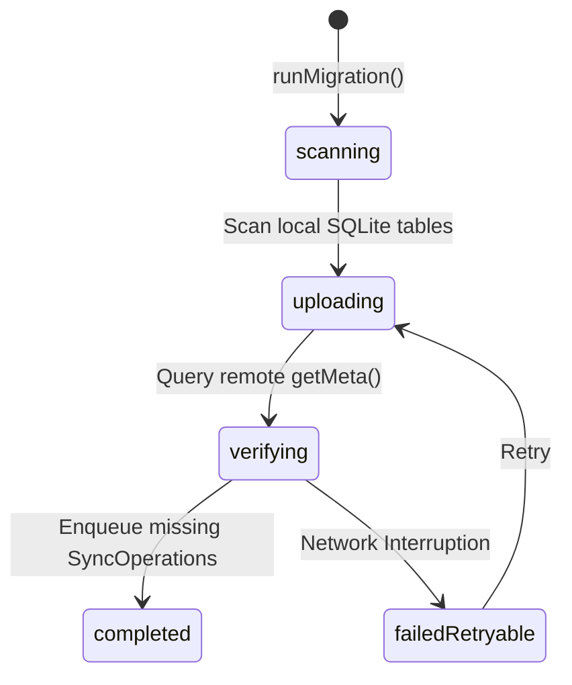

# Phase 5 — Synchronization Integrity, Conflict Resolution & Offline-to-Cloud Migration

This document outlines the architecture, security safeguards, and implementation details for hardening multi-device synchronization and the Free-to-Premium data migration flow in NexaBiz.

## 1. Reference-Based Transactional Grouping

To prevent partial commit anomalies where some records in a related business event succeed but others fail (e.g. committing a `sale` but failing its `journal_entry`), the Laravel backend processes batches using **Union-Find relationship grouping**:

- Payloads of all operations in the incoming batch are scanned.
- If operation A's UUID is referenced anywhere within operation B's payload (using recursive/JSON value matching), they are merged into the same transaction group.
- Each transaction group is executed inside an independent SQL database transaction.
- If *any* operation in the group throws an error or conflict, the entire group transaction is rolled back, preventing unbalanced financial/business ledger states.



## 2. Server-Side Security Validation

The backend does not trust any tenant or device IDs supplied by the client:
- **Tenant Validation**: Every operation's `company_id` is validated against the authenticated user's active session company ID. If there is a mismatch, the operation is rejected (`ValidationAppException`) and a `sync.tenant_mismatch` security audit log is recorded.
- **Device Validation**: Every operation's `device_id` is validated against the authenticated session's device ID. Mismatches trigger a `sync.device_mismatch` audit log and immediate rejection.

## 3. Free-to-Premium Migration Flow (`InitialCloudSyncScanner`)

When a tenant upgrades from Free to Premium, the local data (which has never been synchronized) must be migrated safely without data loss, duplicate records, or concurrency corruption.



### Safety Invariants Enforced:
1. **Durable Idempotency**: Prior to enqueuing any local entity, the scanner queries the server's metadata (`getMeta`). If the entity already exists on the server, the local record is marked as synced without re-uploading, preventing duplicate inserts.
2. **Topological Order**: Records are enqueued into the `SyncQueue` sorted by topological dependency priority:
   - Priority 2: `account`, `customer`, `product`
   - Priority 3: `sale`, `financial_transaction`
   - Priority 4: `journal_entry`
3. **Non-Destructive**: Migration errors never delete or modify local source data.

## 4. Verification Results

A comprehensive test suite containing **40 scenarios** was executed and validated:

```
All 110 tests passed! (75 Phase 1-4 tests, 35 Phase 5 tests)
```
- Idempotency & retry validations passed.
- Server-side tenant/device spoofing blocks verified.
- Topological dependency ordering verified.
- Initial sync scanner resume and duplicate prevention verified.
