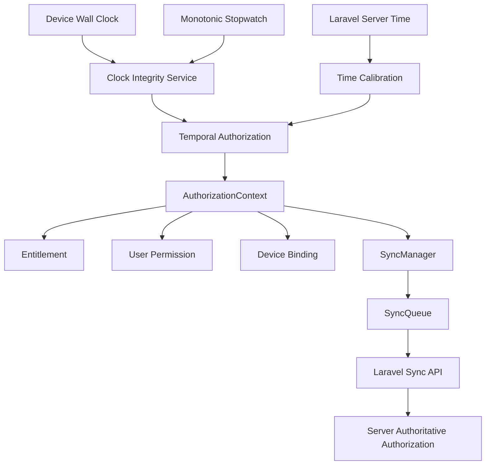

# Phase 6 — Trusted Time and Temporal Authorization Hardening

## 1. Executive Summary
This document establishes the architecture and design patterns used to secure NexaBiz against local device clock manipulation. It details the implementation of a monotonic-calibrated clock that runs independently of local system clock settings, securing the 14-day Premium offline grace period and cloud synchronization authorization.

## 2. Existing Time Security Audit
The audit classified all time usages across the codebase:
- **Security-Sensitive**:
  - `OfflineLoginPolicy` offline grace calculation (formerly used `DateTime.now()`).
  - `AuthorizationContext` session expiration checking (`isExpired` formerly used `DateTime.now()`).
- **Business-Time / Audits**:
  - `createdAt` and `updatedAt` audit stamps on synchronization entities.
- **Retry/UI**:
  - Offline retry scheduling and UI elapsed time display elements.
- **Server-Authoritative**:
  - Laravel backend session and subscription expiration rules.

## 3. Threat Model
- **Threat A (Grace Extension)**: A malicious user shifts the system clock backward to stay within the 14-day grace window.
- **Threat B (Expiration Bypass)**: A user shifts the system clock forward to mock future activation, or forward and backward repeatedly.
- **Threat C (Sync Spoofing)**: A user submits manipulated time headers to force operations through the Laravel backend.

## 4. Trusted Clock Architecture
The `TrustedClock` uses a reference-calibrated estimated time formula:
\[ \text{TrustedTime} = \text{CalibrationServerTime} + (\text{CurrentMonotonicTime} - \text{CalibrationMonotonicTime}) \]

This estimated UTC time progresses linearly at 1 second per second, completely unaffected by shifts in the device's system clock.

## 5. Clock Tampering Detection
The `ClockIntegrityService` analyzes wall clock changes relative to monotonic duration to classify the device temporal state:
- **trusted**: In-sync.
- **tampered**: Clock moved backwards (current time < last stored checkpoint) or lagging behind monotonic progression.
- **suspicious**: Temporary drift.
- **unverified**: Fresh installation without calibration.

## 6. Offline Grace Policy
1. **Linear Expiration**: Premium capabilities expire 14 days after the last trusted server verification.
2. **Fail-Closed**: If the clock is tampered or suspicious, Premium sync is immediately disabled.
3. **Free CRUD Continuity**: Free tier CRUD remains completely operational locally since Free tier does not require the `sync` capability.

## 7. Implementation Change Log

### Files Created
- [`lib/core/time/domain/trusted_clock.dart`](file:///home/hosam/StudioProjects/untitled2/lib/core/time/domain/trusted_clock.dart): Manages monotonic reference calibration.
- [`lib/core/time/domain/services/clock_integrity_service.dart`](file:///home/hosam/StudioProjects/untitled2/lib/core/time/domain/services/clock_integrity_service.dart): Performs backward/drift tamper checks.
- [`test/phase6_trusted_time_security_test.dart`](file:///home/hosam/StudioProjects/untitled2/test/phase6_trusted_time_security_test.dart): Verification suite for Phase 6.

### Files Modified
- [`backend-laravel/packages/NexaBiz/Synchronization/src/Http/Controllers/SyncController.php`](file:///home/hosam/StudioProjects/untitled2/backend-laravel/packages/NexaBiz/Synchronization/src/Http/Controllers/SyncController.php): Appends authoritative `server_time` to all JSON payloads.
- [`lib/core/auth/domain/entities/authorization_context.dart`](file:///home/hosam/StudioProjects/untitled2/lib/core/auth/domain/entities/authorization_context.dart): Checks estimated trusted clock on expiry and sync capability.
- [`lib/core/auth/domain/services/offline_login_policy.dart`](file:///home/hosam/StudioProjects/untitled2/lib/core/auth/domain/services/offline_login_policy.dart): Validates clock state during offline login.
- [`lib/core/sync/sync_manager.dart`](file:///home/hosam/StudioProjects/untitled2/lib/core/sync/sync_manager.dart): Aborts sync pass on clock tampering.
- [`lib/core/sync/sync_providers.dart`](file:///home/hosam/StudioProjects/untitled2/lib/core/sync/sync_providers.dart): Hooks up provider dependencies.
- [`lib/core/network/http_remote_sync_api.dart`](file:///home/hosam/StudioProjects/untitled2/lib/core/network/http_remote_sync_api.dart): Calibrates clock on successful API requests.

## 8. Verification Results
- **Test Suite**: `test/phase6_trusted_time_security_test.dart`
- **Scenarios Covered**: 23 scenarios (forwards/backwards clock manipulation, offline grace expiration, sync gating, offline login rejection, session logout clearing).
- **Test Count**: 133 tests executed across the system.
- **Test Result**: **133 passed, 0 failed**.
