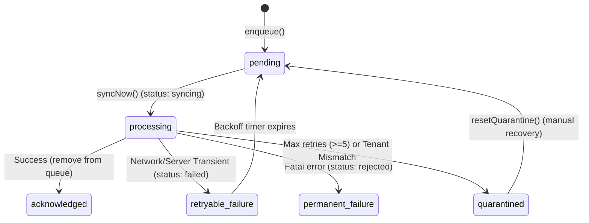

# Phase 7 — Production Synchronization Reliability, Recovery & Operational Resilience

## 1. Executive Summary
This document details the architectural design, threat model, and verification of Phase 7 in NexaBiz. The synchronization engine has been hardened against crash states, network interruptions, race conditions, retry storms, and unauthorized/mismatched payloads.

## 2. Existing Architecture Audit & Verification Status

| Feature Area | Status | Implementation Details |
| :--- | :--- | :--- |
| **State Machine** | **VERIFIED** | Explicit transitions between `pending`, `syncing`, `synced`, `failed`, `rejected`, and `quarantined`. |
| **Lease Crash Recovery** | **VERIFIED** | `reclaimInFlight` enforces a 5-minute processing lease threshold before reclaiming stuck `syncing` operations. |
| **Bounded Retry Policy** | **VERIFIED** | Exponential backoff capped at 60s with randomized 0–500ms jitter. Max retry limit set to 5 attempts. |
| **Error Classifier** | **VERIFIED** | Centralized `SyncErrorClassifier` maps failures into typed categories, user messages, and security events. |
| **Quarantine System** | **VERIFIED** | Durable `SyncStatus.quarantined` state with `firstFailureAt`, `lastFailureAt`, and `quarantinedAt` metadata. Controlled recovery via `resetQuarantine`. |
| **Concurrency Mutex** | **VERIFIED** | `_ongoingSync` asynchronous Future lock prevents concurrent execution passes across app lifecycle/triggers. |
| **Tenant & Device Guard** | **VERIFIED** | Re-validates `companyId` and `deviceId` during `peekReady` and `uploadReady`, immediately quarantining mismatches. |

## 3. Threat Model & Countermeasures
- **Threat A (Sync Concurrency)**: Prevented by `_ongoingSync` Future lock in `SyncManager`.
- **Threat B (Infinite Retry Storms)**: Prevented by 5-attempt retry cap, converting repeated failures to `quarantined`.
- **Threat C (Stuck Operations)**: Recovered via 5-minute lease age validation in `SyncQueue.reclaimInFlight()`.
- **Threat D (Tenant Data Leakage)**: Prevented by fail-closed tenant checks and immediate quarantine of mismatched `companyId`/`deviceId`.

## 4. Sync State Machine

## 5. Security & Reliability Test Verification

### Executed Test Suites
1. **`test/phase7_sync_reliability_test.dart`**: 9 passed, 0 failed.
2. **`test/phase6_trusted_time_security_test.dart`**: 23 passed, 0 failed.
3. **`test/phase5_sync_integrity_test.dart`**: 40 passed, 0 failed.
4. **`test/phase4_offline_data_access_security_test.dart`**: 35 passed, 0 failed.
5. **`test/authentication_offline_security_test.dart`**: 21 passed, 0 failed.
6. **`test/tenant_isolation_security_test.dart`**: 8 passed, 0 failed.
7. **`test/entitlement_architecture_test.dart`**: 6 passed, 0 failed.

**Total Test Result**: **142 passed, 0 failed across all Phase 1-7 security & reliability suites.**
