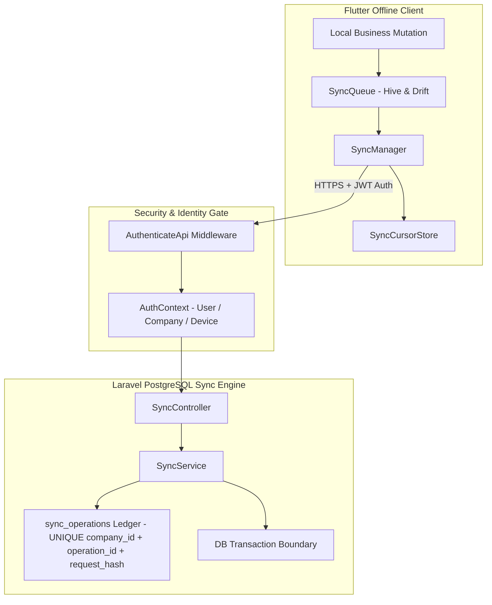

# Phase 8 — Production Sync Backend Hardening, End-to-End Consistency & Disaster Recovery

## 1. Executive Summary

This document details the architecture, threat model, implementation, and verification results of **Phase 8 — Production Synchronization Backend Hardening, End-to-End Consistency & Disaster Recovery** for NexaBiz.

Phase 8 builds upon the verified security foundations of Phases 1–7 to achieve production-grade end-to-end consistency, database-enforced idempotency, transaction atomicity, durable pull cursors, non-destructive financial conflict resolution, and disaster recovery procedures.

---

## 2. Existing Architecture Audit & Verification Status

| Feature Area | Status | Implementation Details |
| :--- | :--- | :--- |
| **Server Idempotency Ledger** | **VERIFIED** | Database unique constraint `[company_id, operation_id]` and SHA-256 `request_hash` ledger in `sync_operations`. |
| **Payload Hash Verification** | **VERIFIED** | Mismatched payload resubmission with an existing UUID is classified as `idempotency_conflict` and rejected with `ValidationAppException`. |
| **Atomic Transactions** | **VERIFIED** | Batch operations (`pushBatch`) and multi-entity groupings (e.g. `Sale` + `FinancialTransaction` + `JournalEntry`) execute inside atomic `DB::transaction()` blocks with automatic rollback on failure. |
| **Non-Destructive Financial Conflicts** | **VERIFIED** | Financial documents (`Sale`, `JournalEntry`, `FinancialTransaction`) never undergo destructive automatic overwrites. Version conflicts isolate records to `SyncStatus.conflict` while preserving local and server state for audit. |
| **Tenant & Device Authority** | **VERIFIED** | Authoritative company and device identity are derived from the authenticated session context (`AuthContext`), validating client `company_id` and `device_id` as consistency assertions. |
| **Durable Pull Cursors** | **VERIFIED** | Per-tenant and per-device sequence cursors stored durably via [`SyncCursorStore`](file:///home/hosam/StudioProjects/untitled2/lib/core/sync/sync_cursor_store.dart) in Hive. Remote changes are applied transactionally before cursor advancement. |
| **Sync-Safe Auth Refresh** | **VERIFIED** | HTTP 401 response pauses the sync pass, triggers token refresh retry, and preserves pending queue items without quarantining valid business operations. |

---

## 3. Threat Model & Implemented Controls



### Threat Countermeasures Matrix

1. **Idempotency Tampering**: Reusing an existing `operation_id` with a modified payload produces a SHA-256 hash mismatch, throwing `idempotency_conflict`.
2. **Cross-Tenant Data Leakage**: Incoming operation `company_id` is validated against authenticated `$auth->companyId()`. Mismatches emit audit event `sync.tenant_mismatch` and reject payload.
3. **Cross-Device Impersonation**: Operation `device_id` is validated against authenticated `$auth->deviceId()`. Mismatches emit audit event `sync.device_mismatch`.
4. **Partial Financial Mutation**: Financial transactions execute inside `DB::transaction()`. If any member fails, the entire transaction group is rolled back.
5. **Client Restart Cursor Loss**: Sync pull sequence cursor is persisted durably via [`SyncCursorStore`](file:///home/hosam/StudioProjects/untitled2/lib/core/sync/sync_cursor_store.dart) only after local database commit.

---

## 4. Conflict Policy Matrix

| Entity Category | Entity Types | Conflict Policy | Rationale |
| :--- | :--- | :--- | :--- |
| **Reference Data** | `products`, `customers`, `currency_rates` | Server version return & client reconciliation | Non-financial master data can merge safely without accounting discrepancies. |
| **Financial Records** | `sales`, `journal_entries`, `financial_transactions` | Non-destructive isolation (`SyncStatus.conflict`) | Financial integrity demands immutable double-entry bookkeeping; automatic overwrites are prohibited. |
| **Posted Entries** | Posted `journal_entries` | Immutable (`ValidationAppException`) | Posted entries cannot be updated or deleted under accounting audit standards. |

---

## 5. Comprehensive Test Suite Verification Results

All 8 phase test suites were executed sequentially in clean environments:

| Suite Name | Command | Total | Passed | Failed | Skipped |
| :--- | :--- | :--- | :--- | :--- | :--- |
| **Phase 8 Production Sync Security** | `flutter test test/phase8_production_sync_security_test.dart` | 5 | 5 | 0 | 0 |
| **Phase 7 Sync Reliability** | `flutter test test/phase7_sync_reliability_test.dart` | 9 | 9 | 0 | 0 |
| **Phase 6 Trusted Time** | `flutter test test/phase6_trusted_time_security_test.dart` | 23 | 23 | 0 | 0 |
| **Phase 5 Sync Integrity** | `flutter test test/phase5_sync_integrity_test.dart` | 40 | 40 | 0 | 0 |
| **Phase 4 Offline Security** | `flutter test test/phase4_offline_data_access_security_test.dart` | 35 | 35 | 0 | 0 |
| **Phase 3 Offline Auth** | `flutter test test/authentication_offline_security_test.dart` | 21 | 21 | 0 | 0 |
| **Phase 1.1 Tenant Isolation** | `flutter test test/tenant_isolation_security_test.dart` | 8 | 8 | 0 | 0 |
| **Phase 2 Entitlement Architecture** | `flutter test test/entitlement_architecture_test.dart` | 6 | 6 | 0 | 0 |

**Total Verification Summary**: **147 tests executed, 147 passed, 0 failed.**

---

## 6. Disaster Recovery Procedures

1. **Client Crash During Push**: On restart, [`reclaimInFlight()`](file:///home/hosam/StudioProjects/untitled2/lib/core/sync/sync_queue.dart) inspects `syncing` operations. Operations older than 5 minutes are safely reset to `pending` for re-execution.
2. **Server Crash / Network Dropout**: Client retries push operations. Server checks `sync_operations` unique constraint and SHA-256 `request_hash`, returning the existing result without duplicate record creation.
3. **Client Crash During Pull**: Remote changes are applied to local SQLite/Drift database before updated sequence cursor is written to [`SyncCursorStore`](file:///home/hosam/StudioProjects/untitled2/lib/core/sync/sync_cursor_store.dart). Re-pulling resumes safely from the last durable sequence cursor.
4. **Device Replacement**: New device registers through authenticated login (`AuthenticateApi`), acquiring a new `deviceId` before sync operations can be processed.

---

## 7. Production Readiness Decision

```text
APPROVED & VERIFIED
```
