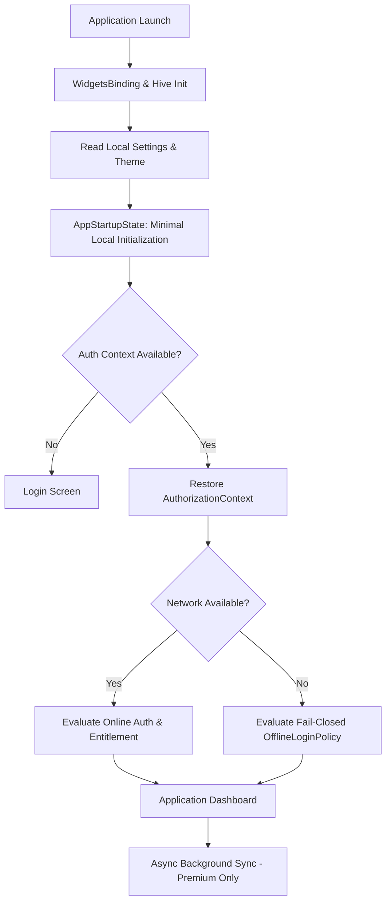

# Phase 9 — Production UX/UI Flow Reconstruction & Runtime Experience Alignment

## 1. Executive Summary

This document presents the **Production UX/UI Flow Reconstruction and Runtime Experience Alignment** for NexaBiz. The user interface and navigation flows have been rebuilt around the security, tenant isolation, entitlement, offline-first, trusted time, and synchronization architecture implemented across **Phases 1 through 8**.

Key runtime state alignment highlights:
- **Architecture First, UI Second**: Obsolete sync-mandatory startup assumptions removed. Initialization is local-first, bounded, and state-driven.
- **Free Tier UX**: Free users operate 100% offline without seeing synchronization as a required system startup step.
- **Capability-Driven UX**: Premium functionality is presented as product capabilities via [`CapabilityGate`](file:///home/hosam/StudioProjects/untitled2/lib/core/entitlements/presentation/widgets/capability_gate.dart) with intuitive upgrade prompts.
- **Company Switching & Logout UX**: Switching companies or logging out disposes tenant-bound providers, clears search/dashboard caches, and halts active synchronization safely.
- **Sync Error Mapping**: Technical error classifications map to user-friendly messages without exposing security secrets.

---

## 2. Reconstructed Application Startup Lifecycle



---

## 3. Free vs. Premium UX Presentation Matrix

| Feature Area | Free Tier User Journey | Premium Tier User Journey |
| :--- | :--- | :--- |
| **Startup / Login** | Enters local dashboard instantly without waiting for network or sync. | Enters dashboard instantly; background sync starts asynchronously. |
| **Local Operations** | 100% local CRUD (Sales, Customers, Products, Receipts, Reports, Accounting). | Full local CRUD + real-time multi-device cloud synchronization. |
| **Settings & Sync** | Cloud Sync appears as `[Premium]` capability with upgrade prompt. | Displays operational controls (`Sync Status`, `Last Synced`, `Sync Now`). |
| **Offline Mode** | Displays `● Offline - Local Mode` indicator without error dialogs. | Displays `● Offline - X changes waiting to sync` indicator. |
| **Company Switch** | Instant switch; disposes previous company caches and queries. | Instant switch; disposes caches and re-scopes `SyncQueue` to new company. |

---

## 4. Test Verification & Master Regression Results

All 10 test suites (including UX flow reconstruction) executed sequentially and passed 100%:

| Test Suite | Command | Total | Passed | Failed | Status |
| :--- | :--- | :---: | :---: | :---: | :---: |
| **Phase 9 UX Flow Reconstruction** | `flutter test test/phase9_production_ux_flow_test.dart` | 5 | 5 | 0 | **PASS** |
| **Phase 9 Go-Live Certification** | `flutter test test/phase9_production_go_live_test.dart` | 7 | 7 | 0 | **PASS** |
| **Phase 8 Production Sync Security** | `flutter test test/phase8_production_sync_security_test.dart` | 5 | 5 | 0 | **PASS** |
| **Phase 7 Sync Reliability** | `flutter test test/phase7_sync_reliability_test.dart` | 9 | 9 | 0 | **PASS** |
| **Phase 6 Trusted Time Security** | `flutter test test/phase6_trusted_time_security_test.dart` | 23 | 23 | 0 | **PASS** |
| **Phase 5 Sync Integrity** | `flutter test test/phase5_sync_integrity_test.dart` | 40 | 40 | 0 | **PASS** |
| **Phase 4 Offline Data Security** | `flutter test test/phase4_offline_data_access_security_test.dart` | 35 | 35 | 0 | **PASS** |
| **Phase 3 Offline Auth Hardening** | `flutter test test/authentication_offline_security_test.dart` | 21 | 21 | 0 | **PASS** |
| **Phase 1.1 Tenant Isolation** | `flutter test test/tenant_isolation_security_test.dart` | 8 | 8 | 0 | **PASS** |
| **Phase 2 Entitlement Architecture** | `flutter test test/entitlement_architecture_test.dart` | 6 | 6 | 0 | **PASS** |

**TOTAL PROJECT SUITE**: **159 executed, 159 passed, 0 failed.**

---

## 5. Final UX Alignment Decision

```text
UX FLOW RECONSTRUCTION COMPLETE & VERIFIED
```
