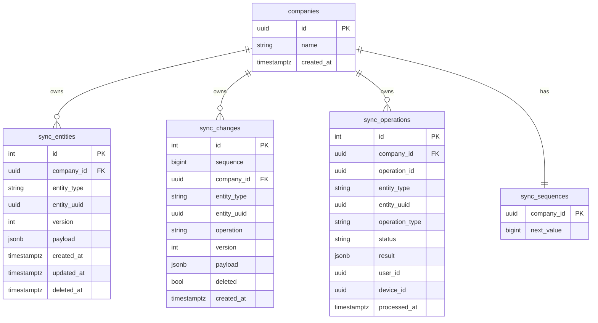
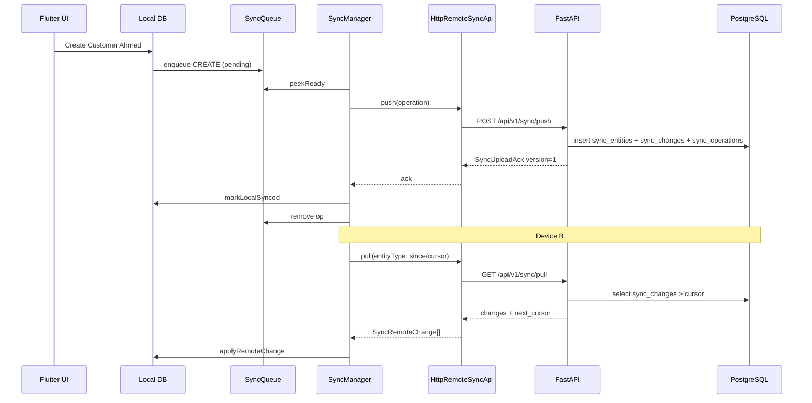
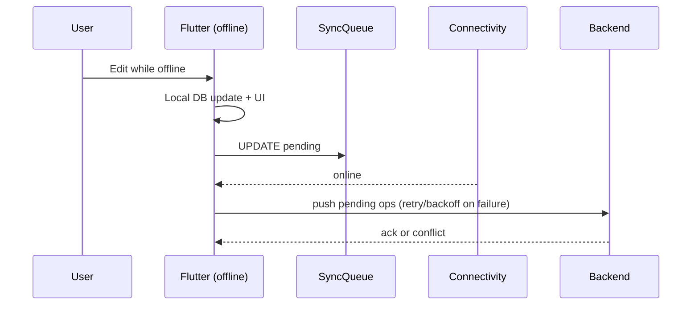
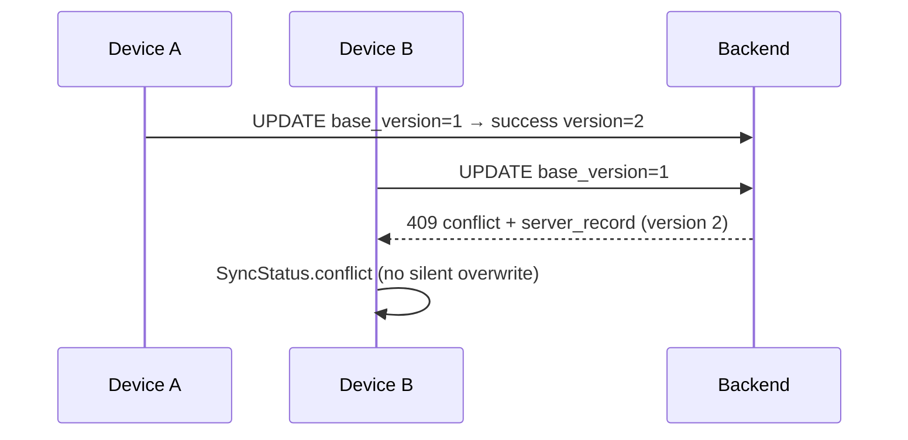
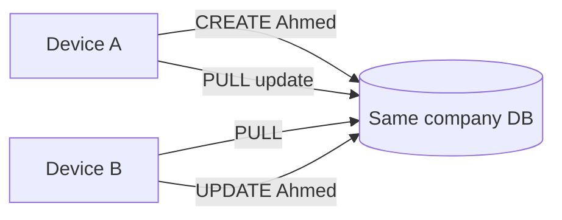

# Experimental Sync — Architecture Diagrams

> **Label:** experimental — not production-ready.

## 1. Backend architecture

```mermaid
flowchart TB
  subgraph Flutter
    SM[SyncManager]
    Q[SyncQueue]
    H[SyncEntityHandlers]
    API[RemoteSyncApi]
    HTTP[HttpRemoteSyncApi]
    MEM[InMemoryRemoteSyncApi]
    SM --> Q
    SM --> H
    H --> API
    API --> HTTP
    API --> MEM
  end

  subgraph Backend["backend/ FastAPI"]
    R[sync router]
    S[SyncService]
    AUTH[Bearer + company/user/device]
    R --> AUTH --> S
  end

  subgraph PG[(PostgreSQL)]
    E[sync_entities]
    C[sync_changes]
    O[sync_operations]
    T[companies / sync_sequences]
  end

  HTTP -->|HTTP JSON| R
  S --> E
  S --> C
  S --> O
  S --> T
```

## 2. Database schema



## 3. Synchronization sequence (push then pull)



## 4. Offline → online



## 5. Conflict flow



## 6. Two-device sync


